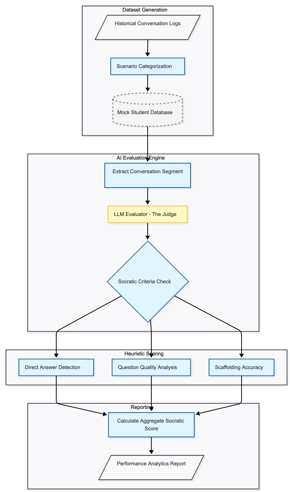

# EDU-Guard: Automated Pedagogical Alignment & Evaluation Framework

**EDU-Guard** is an open-source evaluation framework engineered to audit AI-driven educational interactions for pedagogical integrity. Shifting focus from generic content moderation, this system specifically benchmarks **Socratic Alignment**—the ability of an AI tutor to scaffold student learning through inquiry rather than direct answer disclosure.

## Overview
As Large Language Models (LLMs) are increasingly integrated into classrooms, the need for specialized evaluation beyond "correctness" becomes critical. EDU-Guard provides a robust mechanism to verify that AI applications are educationally sound. It addresses the requirement of building evaluation systems that assess educational quality across massive conversational datasets, with a focus on scaffolding effectiveness and curriculum alignment.


## Core Capabilities
* **Asymmetric Multi-Agent Simulation:** A high-fidelity data generation engine that orchestrates interactions between frontier-model "Student" agents and candidate "Tutor" agents.
* **Pedagogical Rubric Auditing:** An LLM-as-a-Judge pipeline utilizing Chain-of-Thought (CoT) reasoning to evaluate sessions against formal instructional design standards.
* **Local-First Architecture:** Engineered for local inference (via LM Studio or Ollama) to prioritize student privacy and enable accessibility in low-connectivity global environments.
* **Adversarial Persona Testing:** Specialized student profiles designed to "stress-test" AI tutors using social engineering and learned helplessness to identify the limits of pedagogical guardrails.

## Technical Specifications & Architecture

### 1. Robust Persona Maintenance
To mitigate **Persona Drift**—a common failure mode in Small Language Models (SLMs) where agents lose their role identity over extended contexts—the system utilizes **Per-Turn System Reinforcement**. By dynamically re-injecting identity constraints and behavioral boundaries (e.g., "Do not explain concepts") into every turn's prompt, the framework maintains high role adherence across multi-turn sessions.

### 2. Resilient Data Parsing
The evaluation pipeline includes a defensive extraction layer. Using regular expression patterns, the system isolates structured JSON payloads from non-deterministic model outputs. This ensures that even if the Auditor LLM includes conversational preamble, the downstream statistical analysis remains uninterrupted.



### 3. Benchmarking Methodology
The framework utilizes a "Spoiler" control group—tutors programmed to fail—to calibrate the Auditor’s sensitivity. This allows for the calculation of precision and recall metrics regarding the Auditor's ability to detect pedagogical violations.

| Profile | Socratic Score (Avg) | Violation Detection Rate |
| :--- | :--- | :--- |
| Socratic Master | 5.00 | 0.0% |
| The Spoiler (Control) | 0.71 | 100.0% |
| Growth Mindset Coach | 2.00 | 16.7% |

## Requirements

### Hardware
* **Processor:** Apple Silicon (M1/M2/M3) or NVIDIA GPU with 8GB+ VRAM recommended for local inference.
* **RAM:** 16GB minimum.

### Software & Environment
* **Language:** Python 3.11.9
* **Local Inference Engine:** LM Studio or Ollama (must provide an OpenAI-compatible API endpoint at `localhost:1234`).
* **Model Used:** zai-org/glm-4.6v-flash
* **Primary Libraries:**
    * `openai`: For API orchestration.
    * `tqdm`: For progress monitoring during bulk generation.
    * `re`: For regex-based data sanitization.
    * `json`: For atomic JSONL storage.

### Environment Setup
```bash
# Create virtual environment
python -m venv venv
source venv/bin/activate

# Install required packages
pip install openai tqdm
```

## Author

**Jonathon Moore**

> *Building the bridge between Cognitive AI and Embodied Intelligence.*

I am an AI Engineer specializing in the full stack of modern Artificial Intelligence. This project represents the first pillar of my core competencies:

1.  **Evaluation Frameworks:** Quantifying LLM performance.
2.  **Generative Graph-RAG:** Building complex, stateful knowledge systems.
3.  **Embodied Agents (This Project):** Training autonomous decision-making systems in dynamic environments.

---

[](https://www.linkedin.com/in/jonathon-moore-8b49b71bb)
[](https://github.com/hydrenoid)
